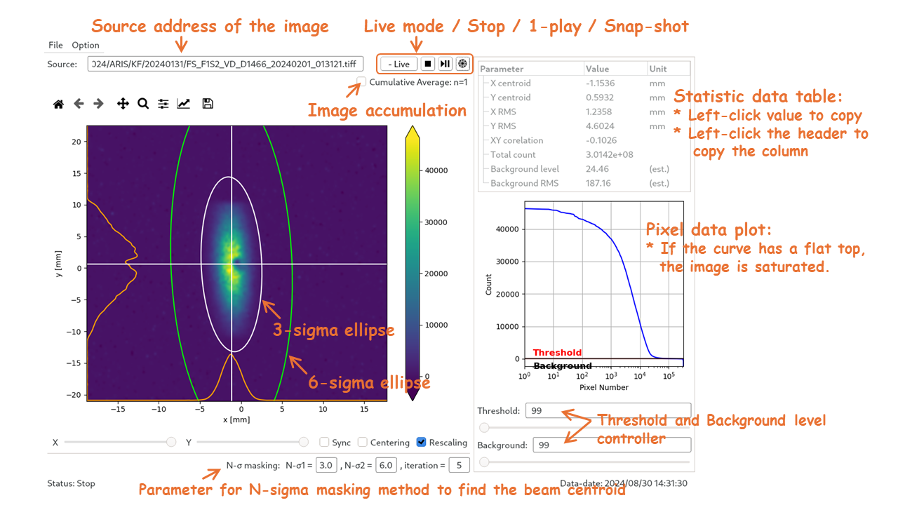
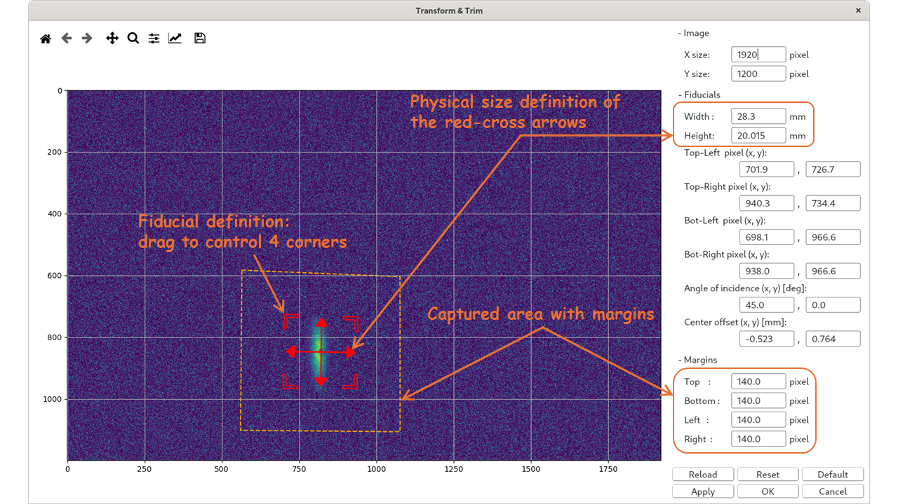
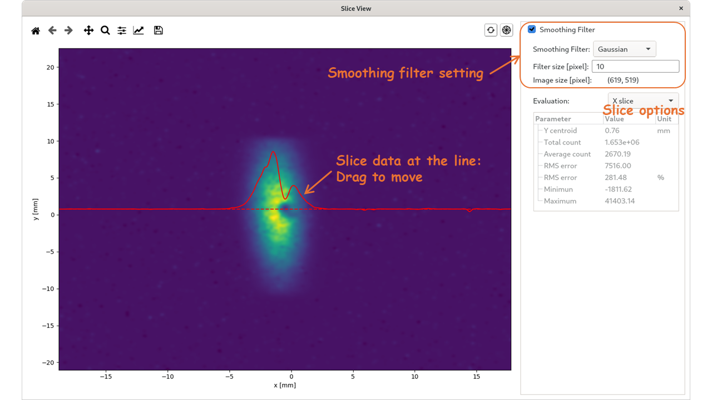
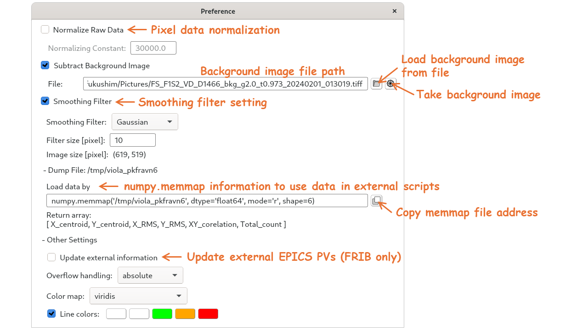

*Viola* (Online Viewer Application)
=================================
Viola is an image analysis application for particle beam images on viewer plates.

Features
--------
- Real time (online) image analysis
- Affine transformation from camera images
- Pixel size to physical size conversion
- Beam centroid and RMS size measurement
- Smoothing filter (Gaussian or Mean)
- Background subtraction
- Save and restore settings

Requirements
------------
- Python3
- PyQt5
- matplotlib
- OpenCV (cv2)

Helpsheet
---------
- Main Window
    - `File` ->
        - `Open Image`, `Open Setting` - Open image/setting file
        - `Save Setting`, `Save Setting As...` - Save json setting file
        - `Save Result` - Save raw data, main window screen shot, and json setting file with time-stamp.

    

- `Option` -> `Transform & Trim`

- `Option` -> `Slice View`

- `Option` -> `Preference`

